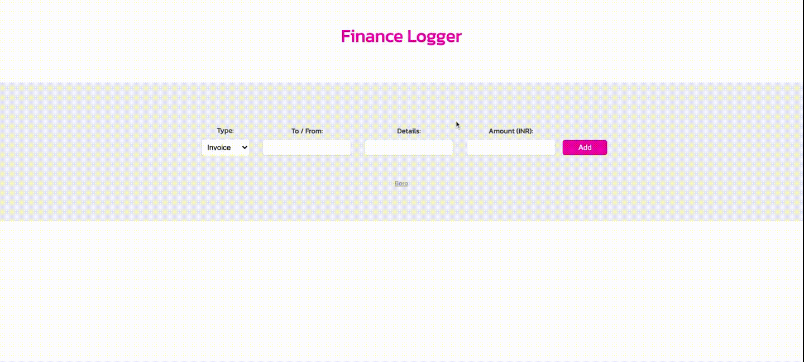

## Finance Logger Application. Built using Typescript.

## How to run?

- git clone `https://github.com/Boro23-wq/Finance-Logger.git`.
- Install Typescript globally running the following command.
    - `npm i typescript -g`
- Run `tsc -w` in the root of your project.
    - `-w` is a watch flag to watch for changes in the file.

## Application Screen:

    
    
